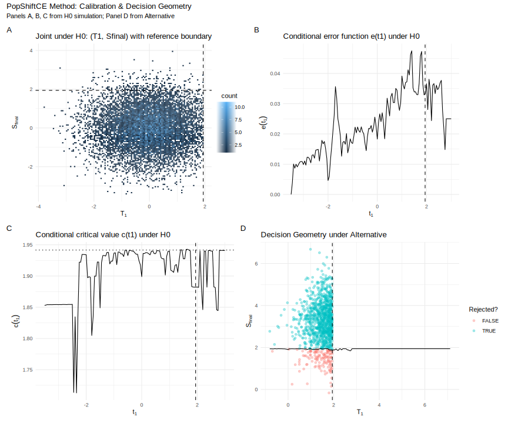

# PopShiftCE: Monte Carlo Conditional Error for Adaptive Trials 🛡️

[](https://opensource.org/licenses/MIT)
[](https://github.com/haohaostats/PopShiftCE/actions/workflows/R-CMD-check.yaml)

**An R package to design and simulate two-stage seamless adaptive trials with partial population shifts, using a Monte Carlo-calibrated Conditional Error (CE) framework.**

This package is the official implementation for the methodology described in the paper:

> *Two-Stage Seamless Adaptive Trials under Partial Population Shift: Surrogate-Only Interim and Monte Carlo Conditional-Error Control*.

The `PopShiftCE` package provides functions to calibrate the trial design, simulate its operating characteristics (Type I error, power, ASN), and visualize the decision geometry.

---
## 🎯 Overview

Traditional adaptive designs face challenges when the enrolled population shifts between stages. This package implements a robust solution where:

* **Stage 1 (Interim) ⏳:** A decision (stop early for efficacy or continue) is made based on a short-term surrogate endpoint.
* **Stage 2 (Final) 🏁:** A full-data analysis is performed on the primary endpoint, accounting for the population shift.
* **Type I Error Control ✅:** The conditional error principle is used to strictly control the overall one-sided Type I error via the conditional error principle. The calibration is performed via intensive Monte Carlo simulation, making the method robust and adaptable to complex final statistics (e.g., using heteroskedasticity-consistent covariance).

---
## 🛠️ Installation

You can install the `PopShiftCE` package from GitHub. There are two options depending on your needs.

#### **1. Standard Installation (Core Functionality)**

This will install the package with only the essential dependencies required for its core calculations and simulations.

```r
# install.packages("devtools")
devtools::install_github("haohaostats/PopShiftCE")
```

#### **2. Full Installation (for Developers and Examples)**

If you wish to run all examples, generate plots, or build the package vignettes, we recommend installing the package along with all its "suggested" dependencies (like `ggplot2` and `patchwork`). The `dependencies = TRUE` argument handles this for you.

```r
# This command installs the package AND its suggested dependencies
devtools::install_github("haohaostats/PopShiftCE", dependencies = TRUE)
```

---
## 🚀 Example Workflow

Here is a complete workflow to design a trial, check its operating characteristics under the null and an alternative, and visualize the results.

### **Step 1: Build the CE Lookup Table 🧮**

This is the core calibration step based on `H0` simulation. It may take a few moments to run.

```r
library(PopShiftCE)

# Use a fixed seed for reproducibility
set.seed(12345)
RNGkind("L'Ecuyer-CMRG")

lookup <- build_ce_lookup(
  n1 = 150, n2 = 150,
  muX_C = 3.0, sigmaX = 0.15, gamma0 = 2.0, gamma1 = 5.5,
  mu0 = 22, sigmaY = 1.0, theta = 1.0, eta = 0.0, piZ = 0.5,
  pi_fixed = 0.5, error_type = "normal", rho_XY = 0.3,
  alpha_one_sided = 0.05,
  B_ref = 50000, # Use a smaller B_ref for quick examples
  batch_size = 5000
)

print(lookup)
```
```
CE lookup: b_ref=1.9416; alpha=0.050; B_ref=50000
```

### **Step 2: Evaluate Operating Characteristics 📊**

#### **(A) Under the Null (Type I Error Control)**

We verify that the error rate is controlled at the nominal level (e.g., 0.05).

```r
set.seed(12345)
res0 <- simulate_trials_ce(
  R = 10000,
  n1 = 150, n2 = 150,
  delta = 0.0, piZ = 0.5, theta = 1.0, eta = 0.0,
  sigmaY = 1.0, error_type = "normal",
  muX_C = 3.0, sigmaX = 0.15,
  gamma0 = 2.0, gamma1 = 5.5, mu0 = 22,
  lookup = lookup, pi_fixed = 0.5
)

print(res0$summary_pretty)
```
```
  rejection_rate early_stop_rate coverage    bias    mse ASN_total ASN_per_arm
1          0.050           0.025    0.950 -0.0001 0.0090     592.4       296.2
```

#### **(B) Under an Alternative (Power)**

We check the trial's power to detect a true effect (e.g., `delta = 0.3`).

```r
set.seed(12345)
res1 <- simulate_trials_ce(
  R = 10000,
  n1 = 150, n2 = 150,
  delta = 0.3, piZ = 0.5, theta = 1.0, eta = 0.0,
  sigmaY = 1.0, error_type = "normal",
  muX_C = 3.0, sigmaX = 0.15,
  gamma0 = 2.0, gamma1 = 5.5, mu0 = 22,
  lookup = lookup, pi_fixed = 0.5
)

print(res1$summary_pretty)
```
```
  rejection_rate early_stop_rate coverage    bias    mse ASN_total ASN_per_arm
1          0.987           0.886    0.971 -0.0015 0.0089     334.1       167.1
```

### **Step 3: Visualize the Design 📈**

The `plot_diagnostic_panel()` function provides a comprehensive "four-in-one" view of the method's mechanics.

```r
# This single function creates a complete diagnostic panel
library(patchwork)  ## install.packages("patchwork")
diagnostic_panel <- plot_diagnostic_panel(
  h0_results = res0$results,
  alt_results = res1$results,
  lookup = lookup
)

# Display the panel
print(diagnostic_panel)

# Save the panel as a vector graphic
# ggsave("figures/Fig_Diagnostic_Panel.svg", diagnostic_panel, width = 12, height = 10)
```



The panel visualizes:
* **(A) Joint Distribution:** The relationship between the interim (`T1`) and final (`S_final`) statistics under `H0`.
* **(B) Conditional Error:** The calculated conditional error function `e(t1)`.
* **(C) Critical Value:** The final critical value `c(t1)` as a function of the interim result.
* **(D) Decision Geometry:** How the calibrated boundaries perform on data simulated under the alternative hypothesis.

---
## Functions at a Glance

> Click to expand each function for **purpose, parameters, and returns**.  
> Math is written with inline LaTeX (e.g., \( e(t_1) \), \( c(t_1) \), \( b_{\mathrm{ref}} \), \( \Delta_{\mathrm{marg}}^\dagger=\delta+\eta\,\pi_Z^\dagger \), \( \hat{Y}=\gamma_0+\gamma_1 X \)).

---

<details>
<summary><code>build_ce_lookup()</code> — Calibrate CE mapping under <em>H0</em></summary>

**Purpose**  
Monte Carlo–calibrate the reference boundary \( b_{\mathrm{ref}} \) and estimate the conditional error \( e(t_1) \) and the conditional critical value \( c(t_1) \).

**Parameters (design & data-generating)**  
- `n1`, `n2` — Stage-1 and Stage-2 **per-arm** sample sizes (totals are `2*n1` and `2*n2`).  
- `muX_C`, `sigmaX` — Mean/SD of surrogate \( X \) in the Stage-1 control arm.  
- `gamma0`, `gamma1` — External linear calibration for the surrogate projection \( \hat{Y}=\gamma_0+\gamma_1 X \) (pre-specified; **not** re-fit at interim).  
- `mu0`, `sigmaY` — Baseline mean/SD of the primary endpoint \( Y \) in \( Z=0 \).  
- `theta` — Main effect of the shifted subpopulation on \( Y \) (baseline shift for \( Z=1 \), applies to both arms).  
- `eta` — Treatment-by-shift interaction (difference in treatment effect in \( Z=1 \) vs \( Z=0 \)).  
- `piZ` — Actual prevalence of \( Z=1 \) among Stage-2 enrollees (drives the partial population shift).  
- `pi_fixed` — Design-fixed prevalence \( \pi_Z^\dagger \) defining the **marginal estimand** \( \Delta_{\mathrm{marg}}^\dagger=\delta+\eta\,\pi_Z^\dagger \) (default `0.5`).  
- `error_type` — Error family for \( Y \): `"normal"`, `"t"`, or `"skew"` (variance-normalized).  
- `rho_XY` — Assumed correlation between \( X \) and \( Y \) used **only in H0 calibration** to recover the dependence between \( T_1 \) and the final statistic.

**Parameters (calibration controls)**  
- `alpha_one_sided` — Target **overall one-sided Type I error** (e.g., `0.05`).  
- `B_ref` — H0 Monte Carlo size (larger → smoother \( e(t_1) \) and \( c(t_1) \)).  
- `batch_size` — Batch size for generating H0 pairs (memory/parallel friendly).  
- `z1_grid` — Grid of \( t_1 \) values on which \( e(t_1) \) and \( c(t_1) \) are estimated.  
- `min_in_bin` — Minimum conditional sample per grid point.  
- `h0` — Initial neighborhood half-width around \( t_1 \) (auto-expands if needed).

**Returns**  
A `ce_lookup` object with:
- `b_ref` — The calibrated reference boundary.  
- `e_fun(t1)` — Conditional error function.  
- `c_fun(t1)` — Conditional critical value.  
- `z1_grid` — The \( t_1 \) grid.  
- `meta` — Calibration metadata (`alpha`, `B_ref`, `rho_XY`, `pi_fixed`, `error_type`, etc.).

**Note**  
Keep `error_type`, `alpha_one_sided`, and `pi_fixed` **consistent** between `build_ce_lookup()` and `simulate_*()`.
</details>

---

<details>
<summary><code>simulate_trial_ce()</code> — Simulate one two-stage trial with MC-CE rule</summary>

**Purpose**  
Run a single two-stage trial: Stage-1 surrogate-only interim for early efficacy; if continued, Stage-2 final uses \( c(T_1) \) for a one-sided decision and reports the CE-consistent one-sided LCL.

**Parameters**  
- Same design/data inputs as `build_ce_lookup()`:  
  `n1`, `n2`, `delta`, `piZ`, `theta`, `eta`, `sigmaY`, `error_type`,  
  `muX_C`, `sigmaX`, `gamma0`, `gamma1`, `mu0`, `pi_fixed`.  
- `muX_T` — *(optional)* treatment-arm mean of \( X \) at Stage-1; if `NULL`, set to  
  `muX_C + delta/gamma1` to align the interim signal with the primary effect (recommended default).  
- `lookup` — The CE lookup from `build_ce_lookup()`.

**Returns**  
A list with:  
`reject`, `early_stop`, `final_est`, `final_se`, `lcl_final`, `lcl_interim`,  
`coverage_final`, `coverage_overall`, `sample_used_total`, `sample_used_per_arm`,  
`z1`, `zf`, `cz1`.
</details>

---

<details>
<summary><code>simulate_trials_ce()</code> — Replicate many trials & summarize operating characteristics</summary>

**Purpose**  
Repeat `R` trials and summarize Type I error/power, coverage, and average sample numbers (ASN).

**Parameters**  
- Same design/data inputs as `simulate_trial_ce()` plus:  
- `R` — Number of replicates.  
- `digits_rate`, `digits_effect`, `digits_asn` — Decimal places for rates, effects, and sample sizes in the pretty summary.

**Returns**  
A list with:  
- `results` — Per-replicate data frame.  
- `summary` — Numeric one-row data frame (for downstream use).  
- `summary_pretty` — Character one-row data frame with fixed decimals (for display).
</details>

---

<details>
<summary><code>plot_ce_mapping()</code> — Diagnostics for CE mapping under <em>H0</em></summary>

**Purpose**  
Plot three diagnostics: the joint \( (T_1, S_{\mathrm{final}}) \) under H0, \( e(t_1) \), and \( c(t_1) \).

**Parameters**  
- `H0_dt` — Data frame with columns `z1`, `zf` (typically from H0 results with `early_stop == FALSE`).  
- `lookup` — The `ce_lookup` object.

**Returns**  
A named list of `ggplot` objects: `pA` (joint), `pB` (\( e(t_1) \)), `pC` (\( c(t_1) \)).
</details>

---

<details>
<summary><code>plot_diagnostic_panel()</code> — Four-in-one panel (H0 + H1)</summary>

**Purpose**  
Create a single four-panel figure:  
(A) H0 joint distribution; (B) \( e(t_1) \); (C) \( c(t_1) \); (D) decision geometry under the alternative.

**Parameters**  
- `h0_results` — `simulate_trials_ce(..., under H0)$results`.  
- `alt_results` — `simulate_trials_ce(..., under H1)$results`.  
- `lookup` — The `ce_lookup` object.

**Returns**  
A combined plot (requires `ggplot2`; if `patchwork` or `cowplot` is present, uses it for layout).

**Note**  
If your current version does not export this function, update to the latest commit or compose panel D yourself with `lookup$c_fun`.
</details>

---
## License

This package is licensed under the MIT License.

## Maintainer
- hao hao ([@haohaostats](https://github.com/haohaostats))